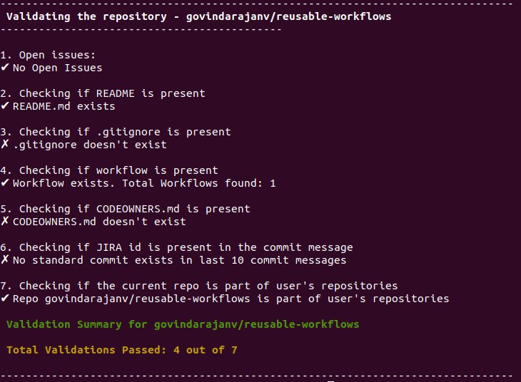

# GH Extension - Validate a Git repository

Validate Repository Extension             

This extension will help you to validate a repository with custom validations set by the platform team
 
 Usage: <br/>
 Install the extension: </br>
	```$ gh extension install govindsme/gh-validate-repo``` </br>
 Run the extension: </br>
	```
	$ gh validate-repo
	```
	

